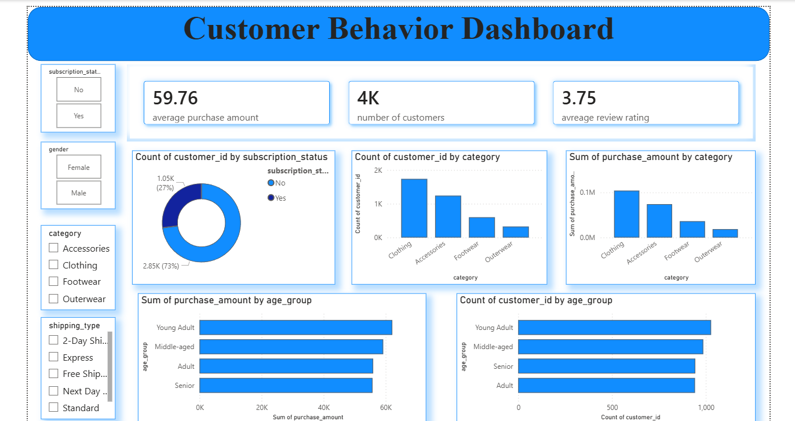

# 📊 Data Analytics Project

## Overview

This project demonstrates an end-to-end data analytics workflow using Python, PostgreSQL, SQL, and Power BI. It covers the complete data analysis process, from loading and cleaning data to performing SQL analysis and building an interactive dashboard for business insights.

---
## Dashboard Preview

The Power BI dashboard provides interactive insights into customer behavior, sales trends, and key performance indicators.



---
## Dataset

The dataset contains customer-related information used for analysis, including:

- Customer demographics
- Purchase history
- Transaction details
- Business-related attributes

---

## Tools & Technologies

- Python
- Pandas
- NumPy
- Matplotlib
- PostgreSQL
- SQL
- SQLAlchemy
- Power BI

---

## Project Workflow

### 1. Data Loading

- Imported the dataset using Pandas.
- Loaded the cleaned data into PostgreSQL using SQLAlchemy.

### 2. Exploratory Data Analysis (EDA)

Performed exploratory analysis by:

- Checking data types
- Identifying missing values
- Detecting duplicate records
- Reviewing summary statistics
- Understanding data distribution

### 3. Data Cleaning

Prepared the dataset by:

- Handling missing values
- Removing duplicate records
- Correcting inconsistent values
- Converting data types
- Preparing the data for analysis

### 4. SQL Analysis

Performed SQL queries in PostgreSQL to generate business insights, including:

- Filtering records
- Sorting data
- Aggregate functions
- GROUP BY and HAVING
- JOIN operations

### 5. Power BI Dashboard

Created an interactive dashboard containing:

- KPI Cards
- Bar Charts
- Line Charts
- Pie Charts
- Slicers and Filters

---

## Dashboard

The dashboard provides insights into:

- Customer distribution
- Sales trends
- Purchase behavior
- Category-wise performance
- Key business KPIs

---

## Results

This project demonstrates:

- Data cleaning and preprocessing
- Exploratory Data Analysis (EDA)
- SQL-based business analysis
- Interactive Power BI dashboard creation
- Data-driven decision making

---

## Project Structure

```text
Data-Analytics-Project/
│
├── dataset/
│   └── customer_data.csv
│
├── notebooks/
│   └── data_analysis.ipynb
│
├── sql/
│   └── analysis_queries.sql
│
├── powerbi/
│   └── dashboard.pbix
│
├── images/
│   └── dashboard.png
│
├── requirements.txt
├── README.md
└── LICENSE
```

---

## How to Run

### Clone the repository

```bash
git clone https://github.com/your-username/Data-Analytics-Project.git
```


### Configure PostgreSQL

- Install PostgreSQL.
- Create a database.
- Update the database credentials in the Python script.

### Run the project

1. Load the dataset in Python.
2. Perform data cleaning and EDA.
3. Load the cleaned data into PostgreSQL.
4. Execute the SQL queries.
5. Open the Power BI dashboard (`.pbix`) and refresh the data.

---

## Skills Demonstrated

- Data Cleaning
- Exploratory Data Analysis (EDA)
- SQL
- PostgreSQL
- SQLAlchemy
- Power BI
- Data Visualization
- Business Intelligence
- Python Programming

---

## Future Improvements

- Automate the ETL pipeline
- Build predictive machine learning models
- Publish the dashboard using Power BI Service

---

## Author

**UMM E ROMAAN SHAIKH**

**Tech Stack:** Python | PostgreSQL | SQL | Power BI | Pandas | NumPy | SQLAlchemy
